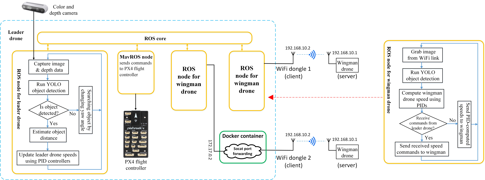

# A Fully Autonomous Heterogeneous Drone Swarm for Collaborative Target Pursuit
---

Leader drone's view (detects wingman and stop sign)

 

Wingman drone's view (detects stop sign only)

This project developed a leader-wingman drone swarm that can autonomously detect and track objects of interest (OOI). The leader drone is a custom-built X500 quadcopter equipped with a Jetson Xavier NX GPU and a visual/depth camera. The wingman drones are low-cost off-the-shelf TELLO mini drones. Python programs were developed to carry out the essential tasks required in the swarm operation, including image capture and preprocessing, object detection, object distance estimation, PID-based navigation control, and communication and video streaming between the leader and wingman drones. All the developed programs are executed on the leader drone’s onboard GPU. The leader and wingman drones communicate via Wi-Fi. Docker containers and port forwarding are utilized to avoid IP conflicts among wingman drones. The project also trained a YOLOv4-tiny convolutional neural network for detecting wingman drones and stop signs (OOI in this project). A novel method was developed to synthesize diverse wingman drone datasets for YOLOv4-tiny training, which improved the network accuracy by up to 4%. In addition, a novel adaptive confidence thresholding method was developed that further increased the network accuracy by 3%, reaching an overall detection accuracy of 88%. The project also investigated how the system performance is affected by the number of wingman drones. With one wingman connected, the developed swarm achieves 25.4 frames per second image processing throughput and 0.1427-second control latency. Finally, the swarm's autonomous operation was successfully demonstrated in outdoor flights.
## Hardware Overview
---
The leader drone hardware is the same as used in the single autonomous drone project (see master branch of this repository). It uses an NVIDIA Jetson Xavier NX GPU for an onboard computer and an Intel Realsense d435i camera.

The wingman drones are DJI Tello EDU drones spray-painted red to be more distinguishable from the background environment. These mini-drones carry an optical camera and send their camera stream to the leader drone via a wifi link. After processing the video, the leader drone sends movement commands back to the wingmen. 

If connecting multiple wingmen to the leader drone, a separate wifi dongle is needed for each wingman connected (plus one additional wifi connection for SSH-ing into the leader drone's computer to control flight tests)

## Software Organization
---

- YOLO_Training_Colab_Notebooks contains Jupyter Notebook files that can be run in Google Colab to train the YOLOv4-tiny network on custom datasets, generate confusion matrices, and work with existing datasets.
- launch contains ROS launch files that start multiple scripts at the same time
- navigation handles leader drone movement
- pose is not used in the swarm implementation
- save_images is used to collect image data for dataset generation or other studies
- tello contains several programs to test different functions of the tello and its connections
- wifi_docker_proxy contains the code needed to run the docker container for port forwarding
- yolo_ros contains all YOLO code as well as wingman controls

## Notes on software
---
**Important: Because I did not really know how ROS worked when I started this project, all the code files recognize the package name as yolov4_trt_ros. Due to the hassle of renaming ROS packages, I decided to just leave it. Before building a clone of this repo, it will probably be helpful to change the folder name to yolov4_trt_ros**

**Also important! To use the docker wifi port forwarding with multiple Tello drones, the djitellopy library must be built from source ([see how here](https://github.com/damiafuentes/DJITelloPy/tree/master)]) and modified. The ./djitellopy/tello.py file from the cloned repo should be replaced with the ./tello/tello.py from this repo. This will allow port forwarding**

- There are quite a few codes in every file used for testing different components of the stack.
- There are also quite a few backup files from previous versions which may or may not work with how things are configured now.
  
## Software dependencies
---
- [ROS Melodic](http://wiki.ros.org/melodic) 
- [YOLO ROS implementation](https://github.com/indra4837/yolov4_trt_ros)
- [pyrealsense2](https://lieuzhenghong.com/how_to_install_librealsense_on_the_jetson_nx/) for Intel Realsense
- [MAVROS](https://docs.px4.io/v1.12/en/ros/mavros_installation.html)
- [Docker containers](https://www.docker.com/) for multiple wingmen connections
- [DJITelloPy](https://github.com/damiafuentes/DJITelloPy/tree/master) for interfacing with Tello
- [PyAV](https://pypi.org/project/av/) for working with Tello video
- Other standard python libraries (numpy, etc.)
- and all dependencies of these libraries

## References and Acknowledgements
---
- ROS implementation of YOLO with TensorRT acceleration from [indra4837](https://github.com/indra4837/yolov4_trt_ros)
- [MAVROS](http://wiki.ros.org/mavros)
- Intel Realsense python [library](https://github.com/IntelRealSense/librealsense)
- DJITelloPy library from [damiafuentes](https://github.com/damiafuentes/DJITelloPy)
- Docker container for wifi communication with multiple Tello drones from [anqixu](https://github.com/anqixu/tello_driver)
- [Techzizou's Medium article and notebook](https://medium.com/analytics-vidhya/train-a-custom-yolov4-tiny-object-detector-using-google-colab-b58be08c9593) for training the YOLOv4-tiny network using custon datasets
- [Makesense.ai](makesense.ai) tool for labeling image data
- PX4 forums and other online discussion
- [Garwin Family Foundation](https://garwinfamilyfoundation.org/) for project funding
